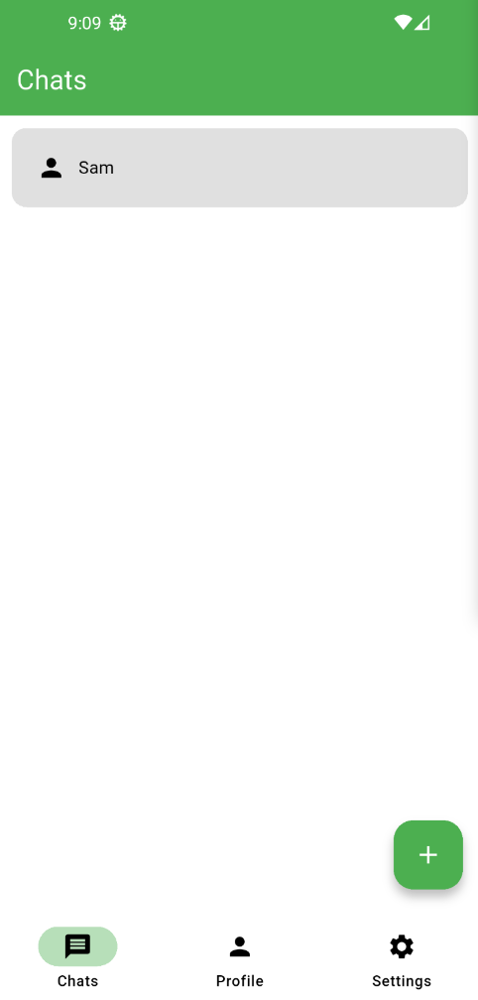
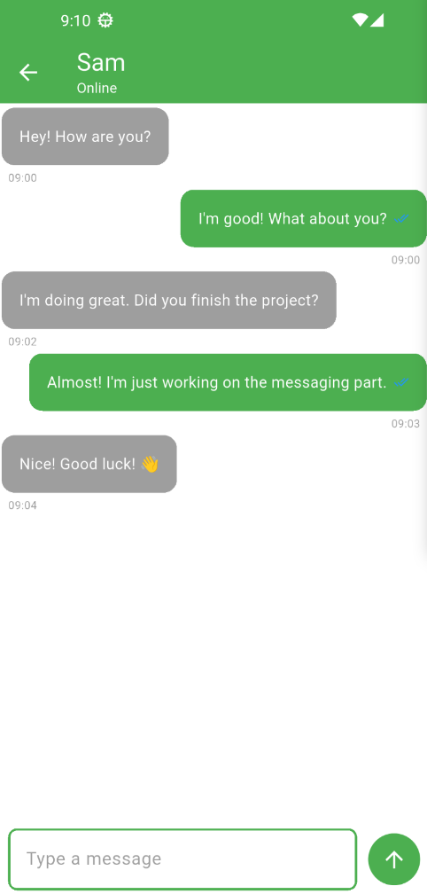
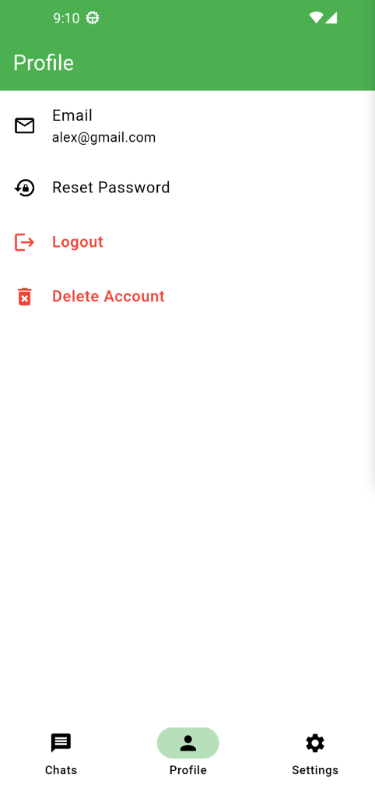
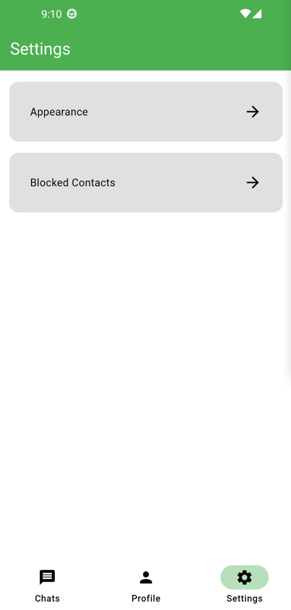
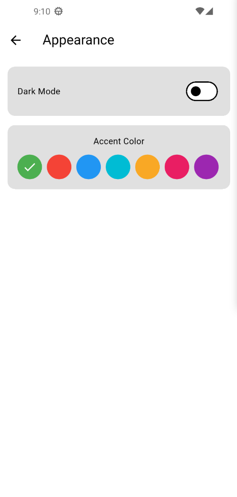
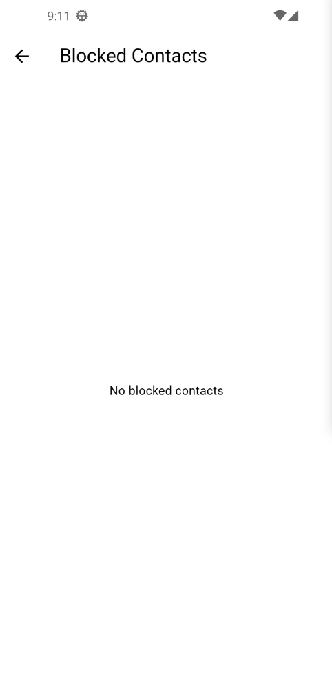

# Messenger

A real-time messaging application built with Flutter and Firebase.

## Features

### Authentication

- User authentication (login, register, password reset)
- Account deletion

### Messaging

- Real-time messaging with Firebase Firestore
- Message deletion
- Message editing
- Read/unread message indicators
- Unread message count badge
- Real-time typing indicator

### Contacts

- Add, delete, and rename contacts
- Block and unblock contacts
- Blocked users management (Settings > Blocked Users)

### Customization

- Dark/Light mode
- Accent color selection
- Appearance settings

## Screenshots

| | |
|---|---|
|  |  |
|  |  |
|  |  

## Tech Stack

- Flutter
- Dart
- Firebase Authentication
- Cloud Firestore
- Provider
- SharedPreferences