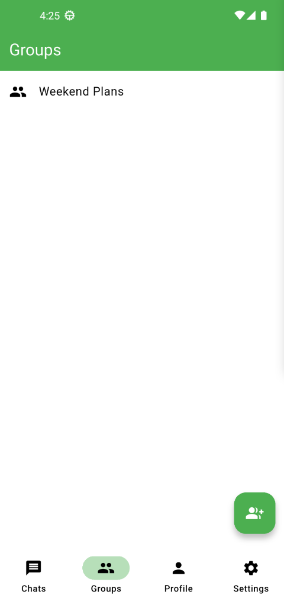
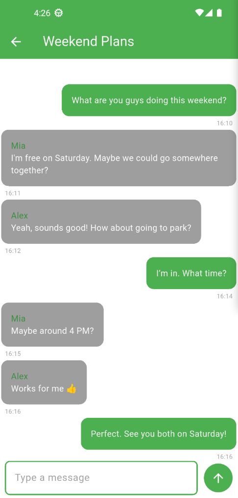

# Messenger

A real-time messaging application built with Flutter and Firebase.

## Features

### Authentication

- User registration and login
- Password reset
- Account deletion

### Messaging

- Real-time messaging with Firebase Firestore
- Edit and delete messages
- Read/unread message indicators
- Unread message count
- Real-time typing indicator

### Group Messaging

- Create group chats
- Add contacts to groups
- Real-time group messaging
- Group member management
- Admin and member roles
- Promote members to admin
- Remove admin privileges
- Remove members from groups
- Leave groups
- Automatic admin reassignment when the only admin leaves
- Rename groups
- Permission setting for allowing members to edit group information
- Group member list
- Group member names and email display
- Edit and delete your own group messages
- Group messages stored in Firebase Firestore

### Image Messaging

- Send images in chat
- Images stored in Cloudinary
- Image message data stored in Firestore
- Delete image messages

### Voice Messaging

- Record and send voice messages
- Recording duration displayed while recording
- Real-time recording status shown to the other user
- Voice message duration displayed below each message
- Playback progress showing listened duration
- Delete voice messages
- Voice files stored in Cloudinary
- Voice message data stored in Firestore

### Contacts

- Add, delete, and rename contacts
- Block and unblock contacts
- Blocked users management (Settings > Blocked Users)
- Contact profile photos

### Profile

- Upload and change profile photo
- Delete profile photo
- Profile photos displayed in contacts and chats

### Notifications

- Push notifications via OneSignal
- Notifications sent only when the receiver is offline
- Cloudflare Worker used as a secure notification backend

### Customization

- Dark and light mode
- Accent color selection
- Appearance settings

## Screenshots

|                                                   |                                                        |
| ------------------------------------------------- | ------------------------------------------------------ |
|       |            |
|     |      |
|    |        |
| | |

## Tech Stack

- Flutter
- Dart
- Firebase Authentication
- Cloud Firestore
- Cloudinary
- Cloudflare Workers
- OneSignal
- Provider
- SharedPreferences
- HTTP
- Record
- AudioPlayers